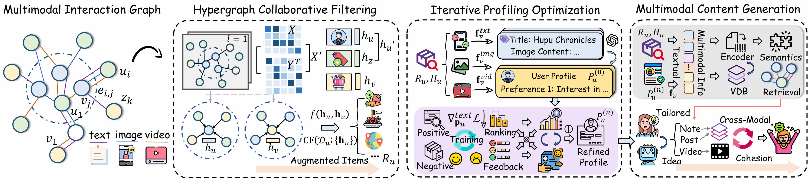

<div align="center">
  <h1>TailorMind</h1>
  <p><strong>A behavior-to-creation framework for personalized multimodal AIGC.</strong></p>

  <p>
    
    
    
    <a href='https://arxiv.org/pdf/2606.23643'></a>
  </p>

  
</div>

## 🌟 Overview

TailorMind is a personalized AIGC framework that connects behavior-aware candidate ranking, multimodal understanding, iterative user profiling, and content generation. It learns from real user behavior on social/content platforms, builds preference-aware user profiles, and generates tailored outputs such as social posts, image-text notes, and video ideas.

The framework is designed around a simple loop:

```text
User behavior -> candidate ranking -> multimodal item understanding
              -> user profile refinement -> tailored content generation
              -> evaluation and reflection -> refined profile
```

## ✨ Highlights

| Capability | What it does |
| --- | --- |
| Multimodal behavior modeling | Builds user-item interaction signals from text, images, and videos. |
| Behavior-aware candidate ranking | Selects candidate content from user interactions and platform data. |
| Multimodal analysis agents | Uses text, image, and video analysts to convert raw content into structured item profiles. |
| Iterative profile optimization | Refines user profiles through validation/test feedback, hit analysis, and reflection records. |
| Personalized content generation | Converts refined user profiles into post ideas, image-text content, and video-oriented creative directions. |
| Platform-aware data pipeline | Supports Bilibili, Xiaohongshu/RedBook, Hupu, and Douban-oriented data flows. |

## 🧩 Architecture

TailorMind contains four major stages:

1. Data collection: crawlers and realtime collectors gather platform interactions and media assets.
2. Candidate ranking: prepares recommended, historical, validation, and test sets for downstream profiling.
3. Profiling: multimodal agents summarize items, build user profiles, and refine them with iterative feedback.
4. Generation: profile-to-idea and product-generation agents create personalized text-image posts and video concepts.

## 🚀 Quick Start

### 1. Clone

```bash
git clone https://github.com/iLearn-Lab/TailorMind.git
cd TailorMind
```

### 2. Create Conda Environment

```bash
conda create -n tailormind python=3.10 -y
conda activate tailormind
```

### 3. Install Dependencies

```bash
pip install -r requirements.txt
```

Some optional video and retrieval components may require system tools such as `ffmpeg` or browser drivers.

### 4. Configure Environment Variables

Create a `.env` file in the repository root:

```env
# Dataset: bilibili, redbook, hupu, douban
DATASET=bilibili

# Chat / multimodal model API
CHAT_API_KEY=your_api_key
CHAT_BASE_URL=https://api.openai.com/v1
CHAT_MODEL=gpt-4o
VIDEO_MODEL=gpt-4o

# Image generation, optional
IMAGE_API_KEY=your_image_api_key
IMAGE_BASE_URL=your_image_base_url
IMAGE_MODEL=your_image_model

# Reflection / retrieval helpers, optional
SEARCH_MODEL=gpt-4o
VISION_MODEL=gpt-4o
TEST_EACH_ROUND=true

# Platform cookies, when needed
REDBOOK_COOKIE=
```

### 5. Prepare Data

TailorMind expects platform data and downloaded media to follow this convention:

```text
dataset/{DATASET}/{real_user_id}/
download/{DATASET}/{real_user_id}/
├── historical/{item_id}/
├── recommended/{item_id}/
├── validation/{item_id}/
└── test/{item_id}/
```

Candidate-ranking mappings and validation/test matrices should be prepared before running the reflection stage.

Each item folder can contain `.txt`, `.jpg`/`.png`, and `.mp4` files. TailorMind will write outputs such as `analysis.json`, `item_profiles.txt`, `user_profile.txt`, `product_ideas.json`, `valid_reflection_results.json`, and `test_reflection_results.json`.

## ⚡ Running the Pipeline

The current `main.py` is an orchestration script with several stages available as commented blocks. By default, it runs enhanced analysis:

```bash
python main.py
```

For modular runs, call individual tools:

```bash
# Build multimodal item profiles and user profiles
python -c "from dotenv import load_dotenv; load_dotenv(); from tools.analyze import analyze; analyze(max_workers=15)"

# Run iterative profile refinement
python -c "from dotenv import load_dotenv; load_dotenv(); from tools.enhanced_analyze import enhanced_analyze; enhanced_analyze(max_concurrent_users=4)"

# Generate personalized products from user profiles
python -c "from dotenv import load_dotenv; load_dotenv(); from tools.product import product; product()"
```

## 🔄 Realtime Collection

Realtime collectors can be used after historical data has been prepared:

```python
from tools.bilibili_realtime_download import BilibiliRealTime
from tools.redbook_realtime import RedBookRealtime
from tools.hupu_realtime import HupuRealTime

bilibili = BilibiliRealTime()
bilibili.process_all_users(save_data=True, download_videos=True)

redbook = RedBookRealtime()
redbook.process_all_users(save_data=True, download_media=True, max_users=200, parallel=3)

hupu = HupuRealTime()
hupu.process_all_users(save_data=True, download_media=True, max_users=200)
```

Platform collectors may require cookies, browser drivers, and compliance with each platform's terms of service.

## 📦 Outputs

| Output | Location | Description |
| --- | --- | --- |
| Item analysis | `download/{DATASET}/{user}/{split}/{item}/analysis.json` | Multimodal summary of text/images/videos. |
| Item profile bundle | `download/{DATASET}/{user}/item_profiles.txt` | Aggregated item-level evidence for profile generation. |
| User profile | `download/{DATASET}/{user}/user_profile.txt` | Preference profile generated from item evidence. |
| Product ideas | `download/{DATASET}/{user}/product_ideas.json` | Profile-conditioned creative ideas. |
| Reflection records | `valid_reflection_results.json`, `test_reflection_results.json` | Iterative validation/test feedback. |
| Global stats | `download/{DATASET}/global_reflection_statistics.json` | Aggregated NDCG/Hit Rate statistics across users. |

## 📊 Evaluation

Useful evaluation scripts:

```bash
# Aggregate NDCG and hit statistics from reflection JSON files
python tools/stat_ndcg_from_json.py --dataset bilibili

# Evaluate generated post quality
python tools/evaluate_post_quality.py

# Evaluate HTML post outputs
python tools/evaluate_html_post.py

# Summarize post evaluation versions
python tools/stat_post_evaluations.py
```
